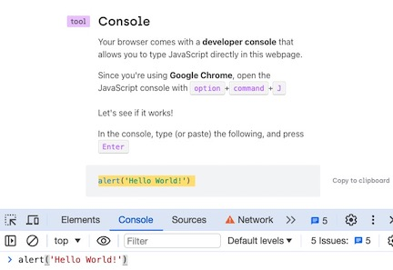
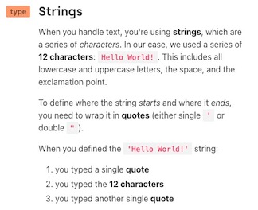
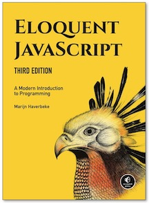
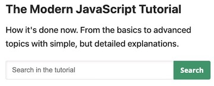
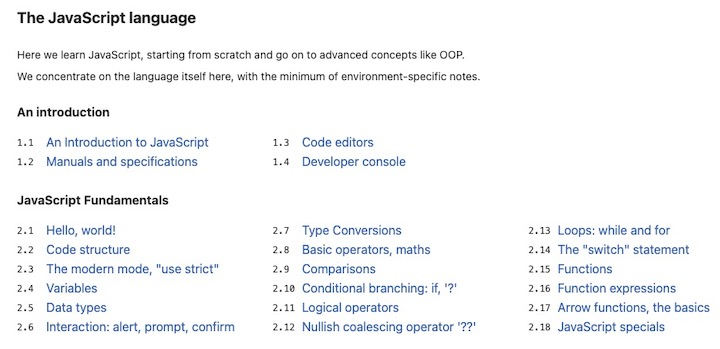
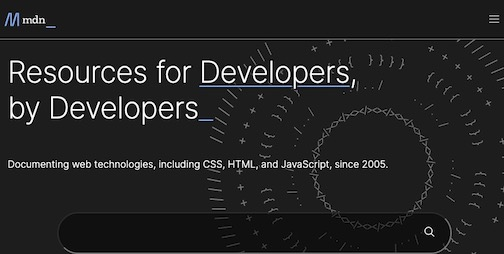
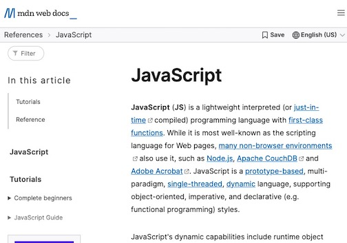

<!-- # JavaScript -->

AgentScript runs in the browser using the JavaScript language which has a fascinating
history, having been introduced for the Netscape server in the mid 1990's.
Here's a [JavaScript TimeLine](https://www.w3schools.com/js/js_history.asp)

There are _LOTS_ of resources for learning JavaScript. You can find several
books, too many to list here!

And there are several tutorials and videos to use, just google _javascript tutorial_ for them.

## JavaScript in 14 Minutes

One of the best for the absolute beginner is [JavaScript in 14 Minutes](https://jgthms.com/javascript-in-14-minutes). It uses the browser's developer console. It will detect your OS and default browseer. I recommend Chrome but it supports them all.


And here's the Developer Console



It gives you small snippets of code which you cut/paste into the console. here's one:



## Eloquent Javascript

Here is a much loved book: https://eloquentjavascript.net/



This is a complete, easy to use reference, "Modern JavaScript": https://javascript.info/





## MDN

And the Mozilla Developer Network (fMDN) https://developer.mozilla.org/



is the _Source of All Truth_ for all things browser. The JavaScript section https://developer.mozilla.org/en-US/docs/Web/JavaScript is quite good, and you can search for any JavaScript primitive easily.



## Developer Console

```js script
console.log('you got executed from an markdown file')
```
